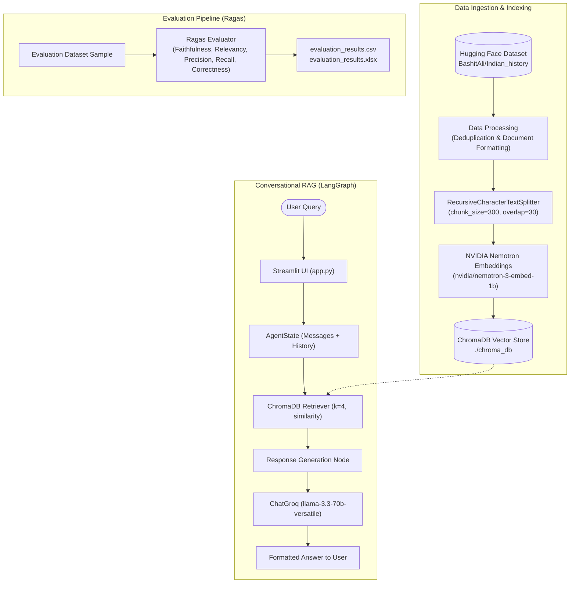

# 📜 Indian History RAG Assistant

A robust, production-ready **Retrieval-Augmented Generation (RAG)** pipeline and conversational assistant specialized in Indian History. Built with **LangChain**, **LangGraph**, **ChromaDB**, **Groq (Llama 3.3 70B)**, and **NVIDIA AI Foundation Endpoints**, featuring comprehensive evaluation using the **Ragas** framework.


## 🏗️ Architecture & Workflow



---

## 📂 Project Structure

```text
├── app.py                  # Streamlit web application & chat UI
├── rag.py                  # Core RAG pipeline with LangGraph state workflow
├── models.py               # Model initializers (Groq, NVIDIA Embeddings & LLMs)
├── embedding.py            # ChromaDB vector store creation and persistence manager
├── data_processing.py      # Hugging Face dataset loading, deduplication, and chunking
├── ragas_eval.py           # Evaluation pipeline using the Ragas framework
├── chroma_db/              # Persistent Chroma vector store directory
├── eval_ds.csv             # Cached query/context/ground-truth evaluation samples
├── evaluation_results.csv  # Output evaluation metrics (CSV format)
├── evaluation_results.xlsx # Output evaluation metrics (Excel format)
├── pyproject.toml          # Project dependencies and environment specification
├── uv.lock                 # Lockfile for reproducible environment setup
└── README.md               # Project documentation
```

## 🛠️ Tech Stack

- **Orchestration & Workflow**: [LangChain](https://www.langchain.com/), [LangGraph](https://langchain-ai.github.io/langgraph/)
- **LLM Provider**: [Groq](https://groq.com/) (`llama-3.3-70b-versatile`)
- **Embedding & Eval Models**: [NVIDIA AI Endpoints](https://www.nvidia.com/en-us/ai-data-science/products/nim/) (`nvidia/nemotron-3-embed-1b`, `openai/gpt-oss-120b`)
- **Vector Database**: [ChromaDB](https://www.trychroma.com/) (`langchain-chroma`)
- **Evaluation**: [Ragas](https://docs.ragas.io/)
- **Frontend / UI**: [Streamlit](https://streamlit.io/)
- **Package Manager**: [uv](https://github.com/astral-sh/uv) / Python `pyproject.toml`

---

## 🚀 Getting Started

### 1. Prerequisites

- Python `>= 3.12`
- API Keys:
  - **Groq API Key**: [Get a Groq API Key](https://console.groq.com/)
  - **NVIDIA NGC API Key**: [Get an NVIDIA API Key](https://build.nvidia.com/)
  - **Hugging Face Token** *(Optional)*: Required only if accessing gated datasets.

---

### 2. Installation

Clone the repository and install dependencies:

#### Using `uv` (Recommended):
```bash
# Install dependencies from uv.lock / pyproject.toml
uv sync
```

#### Using standard `pip`:
```bash
# Create and activate a virtual environment
python -m venv .venv
source .venv/bin/activate  # On Windows: .venv\Scripts\activate

# Install dependencies
pip install .
```

---

### 3. Environment Variables Configuration

Create a `.env` file in the root directory:

```env
# LLM & Embedding API Keys
GROQ_API_KEY=your_groq_api_key_here
NVIDIA_API_KEY=your_nvidia_api_key_here

# Hugging Face (Optional)
HF_TOKEN=your_huggingface_token_here

# Vector DB Persistence Path (Optional, defaults to ./chroma_db)
PERSIST_DIRECTORY=./chroma_db
```

---

## 🖥️ Usage

### 1. Run the Streamlit Chat Application

Start the web interface to query the Indian History assistant:

```bash
streamlit run app.py
```

Open your browser at `http://localhost:8501`.

---

### 2. Build or Rebuild the Vector Database

The vector database is automatically loaded or created on first run. If you want to manually build or verify vector index ingestion:

```bash
python embedding.py
```

This will:
1. Fetch the `BashitAli/Indian_history` dataset from Hugging Face.
2. Clean and deduplicate instruction-response pairs.
3. Split content into overlapping chunks using `RecursiveCharacterTextSplitter`.
4. Generate embeddings via NVIDIA AI endpoints and index them in `./chroma_db`.

---

### 3. Run RAG Evaluation (Ragas)

To run automated quantitative evaluation on the RAG pipeline:

```bash
python ragas_eval.py
```

This runs the Ragas evaluation suite against 20 benchmark questions and evaluates:
- **Faithfulness**: Validates whether the answer is grounded in retrieved context.
- **Answer Relevancy**: Evaluates if the response directly addresses the question.
- **Context Precision**: Measures the signal-to-noise ratio of retrieved chunks.
- **Context Recall**: Checks if all ground-truth facts were retrieved.
- **Answer Correctness**: Measures semantic and factual accuracy against ground truth.

Results are exported to `evaluation_results.csv` and `evaluation_results.xlsx`.

---

## ⚙️ Configuration & Customization

| Parameter | Location | Default Value | Description |
| :--- | :--- | :--- | :--- |
| `generator_llm` | `llama-3.3-70b-versatile` | Groq chat model for generating responses |
| `embed_llm` | `nvidia/nemotron-3-embed-1b` | Embedding model for vector representation |
| `chunk_size` |  `300` | Token/character size per text chunk |
| `chunk_overlap` |  `30` | Overlap between adjacent chunks |
| `k` | `4` | Top-K documents retrieved per query |
| `search_type` | `similarity` | Retrieval search strategy (`similarity`) |

---
